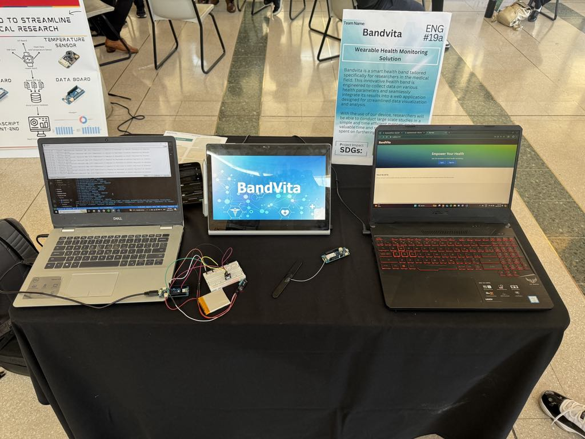

# Smart Health Band for Medical Researchers

## Project Overview

The objective of our capstone project is to instigate the development of a smart health band tailored specifically for researchers in the medical field. This innovative health band is engineered to collect data on various health parameters, seamlessly integrated to a web application designed for streamlined data visualization and analysis. This will be geared towards the use of medical researchers since our goal is to incorporate mass data into easy to read and visualise formats. With the use of our device researchers will be able to conduct large scale studies in a simple and time efficient manner, saving valuable time and resources that can be spent on furthering medical research.

The chosen design embodies simplicity, featuring a discreet wristband housing an array of sensors strategically positioned on the underside of the wristband. These sensors include a heart rate sensor and blood oxygen sensor. The device interfaces with a web application that incorporates user account authentication through login to ensure data security. The application also includes a sign up page for new incoming users to create an account to login to view their data. Moreover, seamless data transfer is ensured between the azure backend and the frontend made in react. Lastly, the application includes a dashboard after the user is authenticated that allows them to visualize and analyze data that is collected from the smart health band.

Our design will incorporate LTE-M IoT boards. We have chosen to both incorporate a wifi as well as a data board serving as a backbone for data transfer and utilizing specific sensors directly connected to the board. Our prototype design will consist of sensors connected directly to the board to ensure that sensors are working and data transfer is also working as expected. Sensor testing and troubleshooting will be done via Arduino.

Technical risks associated with the project include fitting various sensors on an ergonomic and easy to wear wristband. Ensuring data transfer is seamless and that data and changes to data can be viewed in real time. User data must be secure since breaches of health data could result in vulnerability for researchers as well as volunteers conducting research. Ensuring all components work correctly and work well with each other will be a difficult task, as well as ensuring the project remains under the provided budget.

## Frontend Overview

The frontend of the project includes a web app built in React. BandVita’s frontend provides a slick and minimalistic user interface where users can interact with, view, and analyze the health data. The frontend contains four main component pages: The welcome page, the sign-up page, the login page, and the dashboard which displays user data.

### Welcome Page Component

The welcome page serves as the landing page of the application. The page is strategically designed to engage users immediately with its clean and modern aesthetic. The component consists of a navigation bar, a hero section with calls to action that features ‘Log In’ and ‘Sign Up’ buttons, and an about section. It also uses straightforward React functional component structure with JSX. Style references and navigation links are properly implemented. Potential enhancements could include adding more navigation items and interactive features in the hero section. In terms of future enhancements, there is potential for expanding the navigation bar to include additional items, such as direct links to product features and contact information.

### Login Page Component

The Login Page Component is a critical element of the BandVita application, as it authorizes and authenticates user login data. It includes space for users to enter their login credentials, and then authenticates them. If there are incorrect validations, the system will report an error stating that “the user credentials are incorrect”.

Handles user login functionality and includes form handling, state management, and navigation. It utilizes React’s useState for state management and useNavigate for redirecting users post-login. It also handles credentials validation against a static JSON data file, which simulates a database check.

### Sign Up Page Component

Allows new users to register. It collects user data through a form and updates local JSON storage. It employs state management effectively with useState. It contains basic validation for username, password, and email is present, though email validation logic is overly simplified and marked as a placeholder.

Upon form submission, the entered user data is stored in a local JSON storage. This approach is particularly useful during the development stage for testing and demonstrating the signup process without the need for a live backend system.

This component is not only functional but also focused on providing a seamless and secure user experience.

### Dashboard Component

Displays a personalized welcome message and a list of the user’s test results. It retrieves current user data from local storage, which poses a security risk if sensitive information is stored. It maps over currentUser.testResults to display results, demonstrating effective use of array methods in React for rendering lists.

### Azure.js Module

Interfaces with Azure Cosmos DB to fetch and store data. Features include asynchronous functions, error handling, and file operations. Proper use of modern JavaScript features like async/await for asynchronous database interactions. Includes error handling which is crucial for debugging and ensuring application stability.

